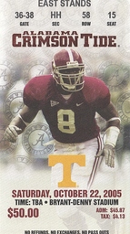

I've been meaning to put this baby up forever, and I finally got around to scanning it (albeit two years later as you can see from the date).

This was the game where where Jamie Christiansen won the game with that ugly kick and of course Roman Harper's famous forced fumble, memorialized by Daniel Moore in [Rocky Stop.](https://www.danielmooreart.com/al-rs/) I'd still like to add a copy next to Tyrone Prothro's amazing catch and put the stub inside the frame.

Before the game, I got to meet my aunt, uncle, and a couple of cousins for some mean Mexican. That was after the Florida game where we humbled the cocky Urban Meyer. I heard the ground was literally rumbling from all the cheering. Wish I coulda been there too!

We had *great* seats — at the 40 yard line — and could see everything. I remember being sick of hearing it from my Tennessee-fan friends (if there can be such a thing). I even told my aunt that I'd rather beat UT than Auburn if we could only have one.

(If you remember, that was how it ended up. My brother-in-law who scored those tickets also had a hookup for Iron Bowl tickets. After Prothro took that horrific injury on a stupid, needless, low-class, NFL-style showoff long pass when the Gators were already starting to load the buses — Shula, you dog! — we just didn't have it. They were mine for the taking, and I easily said, “No thanks.”)

But now the bad times are behind us: [it’s morning in Alabama!](https://bowilliams.com/2007/01/its-morning-in-alabama-greg-bacon/)
